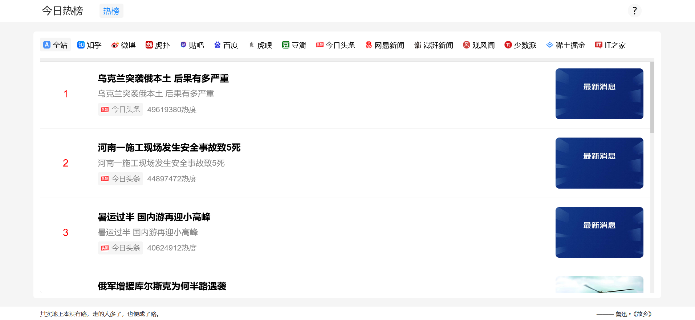

# 项目名称：热点资讯聚合系统
### 项目版本：1.0.0
### 作者：absdom
### 联系方式(QQ)：1572129487@qq.com

# 页面展示
## PC端

## 手机端

# 项目介绍
    此项目用于实时获取新闻、资讯平台上的热榜数据。
    前端采用HTML+BootStrap框架实现。
    后端采用Java+SpringBoot框架实现。

# 项目开发结构
## 前端
### 使用的语言
    HTML、JS、CSS、JQuery、Thymeleaf
### 使用的框架
    BootStrap框架
## 后端
### 使用的语言
    Java、MyBatis
### 使用的框架
    SpringBoot框架
## 数据库
    MySQL

# 项目要点
    1、前端页面采用动态页面大小以及动态字体大小的设计，这样的设计便于PC端、平板、手机端的自适应分辨率的展示。
    2、项目后端采用定时器实现热榜数据的定时抓取，实现方式是使用SpringBoot中集成的@Scheduled注解来实现，项目采用的是每隔1小时爬取热榜数据。
    3、项目包含后台管理功能，管理员账户可以直接在页面修改项目中的数据。

# 项目使用方法
    1、首先下载此仓库到本地，HTTP下载地址为：https://github.com/Inquiter/dailyhotlist/archive/refs/heads/master.zip。
    2、然后找到dailyhotlist/src/main/resources/applicatioin.preperties文件，修改数据库的配置信息。
    3、之后找到dailyhotlist/dailyhotlist.sql文件，在数据库中运行此文件。
    4、最后在IDEA等开发软件中加载maven配置，然后启动就能使用了。
    
# 项目数据库
    此项目使用的是云端数据库，数据库的配置在dailyhotlist/src/main/java/resources/application.properties文件中，可自行修改。

## 项目声明：这是一个开源项目，禁止任何人商用此项目！违者必究！
